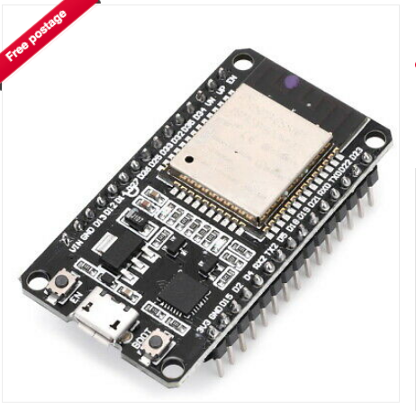

# EngineMonitor

An engine monitor using a ESP-WROOM-32 board from ebay. It senses 1wire temperature, i2c pressure and temperature (BMP280), and has 2 digial inputs and 4 analogue inputs (ADS1115) for monitoring a typical marine diesel engine. In addition there is a JDY-40 serial RF interface for polling remote sensors.

It emits NMEA2000 messages to a NMEA200 bus, with configuration over Classic Bluetooth serial, saved to flash.

It supports PGN PGN127488 (rapid engine), PGN127489 (engine data), PGN130312 (various temperatures), PGN127508 (battery status), PGN127513 (battery configuration).

Sensors include:

* RPM from W+ terminal of alternator.
* Coolant Temperature
* Oil Pressure
* Fuel Level
* Alternator Voltage
* Alternator Temperature
* Exhaust Temperature
* Engine Room Temperature
* Environment Temperature and Pressure

Other values for the PGNs above are based on interpolation, best guess, fake, where possible. Target engine is a D2-40F, so the code is setup for that engines curves and prop. Most parameters can be changed over the Bluetooth serial CLI.

## RF

Over RF (TBD), Devices based on Arduino Pro Mini, JDY-40, ADS1115 (Arduino ADC not flexible enough). JDY-40s provide a serial 128 RF bands. In each band devices with the same RFID (WirelessID 2bytes) and DVID (Device ID 2bytes). Both the transmitter and reciever channel, RFID and DeviceID must match for packets to be transfered. These are set by AT commands to switch the trancever into that mode. The device will ignore packets that dont match and wont recieve packets that are on a different channel.

JDY-40s were chosen becuase they have a simple serial interface and are relativey low power. BT Classic would have been an alternative but requires pairing and wont work in a mesh and doesnt have the range (top of mast for some sensors). BLE, is just too complex to be bothered with. ZigBee modules are too expensive. NRF24L01+ could have been used, however the interface is SPI. If the JDY-40 cant operate in a mesh then they may need to be replaced with NRF24L01+. For the moment JDY-40 seems the simplest approach, however there is no deal on the JDY-40 RF protocol whereas the NRF24L01+ is detailed https://www.sparkfun.com/datasheets/Components/SMD/nRF24L01Pluss_Preliminary_Product_Specification_v1_0.pdf and has a TCP like RF protocol, and allows upto 6 transmitters to send to a single reciever over parallel data pipes. 

### Communication pattern.

The sensors involved need to provide data periodically, eg every 10s rather than stream continuously at 5Hz. So the simplest mechanism is to use the RFID ID/DeviceID setting in the JDY40. Each node is allocated a ID. On start it waits for a query. The base cycles through each ID requesting data and waiting for a set period for a response before moving to the next device. No blocking operations with communications going via the main loop.

### Protocol

Single line terminated by a NL. Fields comma seperated with the last field being a hex encoded crc16. 
    
      deviceid,datatype,field1,field2,...,fieldn,checksumNL

      device id is the id of the device, 0-255, hex
      datatype defines the fields, 0-255, hex
      field1..n the fields, text formatted.
      checksum a hex crc16 of the whole line excluding , before the checksum.
      NL a new line character.

* Engine Battery voltage, current, temperature, configuration
* Service Battery voltage, current, temperature, configuration

## PCB

The PCB handles power and signal cleaning. 
It is single sided and can easilly be created using basic laser printer+CuCl etching at home, or using a CNC PCB Milling machine (FlatCAM+Candle). 

Power consumption is < 50mA@5V RF sensors consume < 25mA@3.3V

Board used is a ESP-WROOM-32D based board with Wifi and Bluetooth, although Wifi is not used. Available from eBay. https://www.ebay.co.uk/itm/143297558340 30 pin DIL.
Datasheet of the chip https://www.espressif.com/sites/default/files/documentation/esp32-wroom-32d_esp32-wroom-32u_datasheet_en.pdf

Most of the remainder of this readme is notes.

# ESP32 pins

Not all ESP32 pins can be used, but most ESP32 pins can be remapped unlike Arduino boards. 

See PCB Schematic for details of how pins are used.
Pin numbers are the WROOM32 board pin numnbers, names are the pin name of the ESP32 chip.

Digital pulse in 1 -> Pin10/GPIO27
Digital pulse in 2 -> Pin9/GPIO26
RF Chip Enable (low to enable) -> Pin20/D4
RF Serial RX -> PIN21/RX2/GPIO16
RF Serail TX -> Pin22/TX2/GPIO17
RF Serial Enable -> Pin23/D5
CAN RX -> Pin24/D18
CAN TX -> Pin25/D19
1 Wire -> Pin26/D21
i2c SCL -> Pin29/D22
i2c SDA -> Pin30/D23

On the i2c bus is a BMP280 (temp/pressure) and an ADS1115 (4ch 16bit precision ADC) with a pin header for extension.
The Digital pulse is sharpened with a 74HC14 trigger.
CAN Trancever is a MCP2562
RF Serial is a JDY-40 with a Beken BK2461 controller and custom firmware. (2.4 GHz)

ESP32 ADC is non linear and frustrating to use, hence the i2c ACD.

D2 cant be used as its attached to the LED on the board.

GND on 14,17, VIN 5V on 15, 3.3V out on 16 
Other boards may vary but this seems to be a common pattern probably based on a standard Espresif design.

See signalk/SenseESP for details on how to develop.

# Connections

The board is intended to monitor the engine, other boards may monitor over the RF link, which avoids having to have many
devices connected to the N2K bus and long wires pulled through tight conduits.

## RF

### Battery Monitoring

Pro Mini with RF board using ACS758xCB at suitable range (eg ACS758ECB-200B-PFF-T, 10mV/A output bidirectional) 1 per battery bank sending data over RF on request, include a 1 wire sensor to sense terminal temperature. Should work as a single board screwed onto the battery terminals.

## 1 Wire

* 3.3v orange marked + board side
* signal white/orange marked nothng
* - green marked - case side

* Alternator Temp 
* Exhaust Temperature 
* Engine Room Temperature
* Service Battery Temperature 

Onewire sensors tend to not be rugged enough to attach directly to a engine block, see below
for coolant temp

## Pulse

* NC Blue, case side, marked 2
* W+ Orange, board side marked 1

## i2c

* BMP280 
   Engine room pressure, less that atmospheric indicates air flow problems.
   Engine room temperature (perhaps, however see 1 wire above)
* ADS1115
   ADC0 = Coolant Temperature Sensor - Blue/Orange - case side, marked C
   ADC1 = Alternator Voltage - White/orange, marked A
   ADC2 = Service battery Voltage - White/brown, marked O (was Oil)
   ADC3 = Fuel Level   - brown - esp32 side, marked F

# NMEA2000 connection

Using an AMP Superseal 4 way connector
Pin 1 +12V - Red
Pin 2 GND - Black
Pin 3 CanL - White
Pin 4 CanH - Blue
Shield GND plane on PCB

GND connected to the NMEA2000 bus may need to be reviewed depending on if there is any voltage differential between NMEA2000 GND and Engine GND due to Charging currents from the alternator. Coolant Temperature will be impacted the most followed by Fuel Level, Oil Pressure and Alternator voltage if there is a significant voltage drop. This will put the NMEA2000 GND +ve to the engine GND increasing the aparant measured coolant temperature and Fuel level when the Alternator is producing high charge output. The GND connection from Engine to Ships GND is short, but not 0R.  

# NMEA2000 PGNs

When connecting the EngineMonitor to a Raymarine MFD it reported errors for messages not expected in Class 50, Propulsion, Function 160 Engine gateway. The suspicion is that non Engine related messages need to be emitted from NMEA2000 device other than the Engine

Engine Monitor Device Class 50 Propulsion, Function 160 Engine gateway. or 140 Engine
127488 (0x1F200) Engine Parameters, Rapid Update 0.1s
127489 (0x1F201) Engine Parameters, Dynamic 0.5s
127505 (0x1F211) Fluid Level 2.5s
130316 (0x1FD0C) Temperature Extended Range

General Temperatures 75/130
130312 (0x1FD08) Temperatures

Atmospheric 85/130
130311 (0x1FD07) Environmental Parameters 10s

Batteries 35/170
127508 (0x1F214) Battery Status

# Related information

This project is targeting a D2-40 engine.

Volvo Penta D2-40 engines like many other Volvo engines have a Mechanical Diesel Interface (MDI) that provides a J1939 interface to the sensors. MDIs are limited in what they sense, and so are probable limited in what they report.

Based on the workshop manual and physical connections the sensors available to the MDI are:

* Supply Voltage
* Coolant Temp, thermistor.
* Oil Pressure Switch
* Flywheel Hall sensor
* Glow plugs (current sensor tbc)
* Starter relay
* Buttons on the control pannel.

Note, there is no ECU on D1,D2 engines as the base engine is a fully mechanical Perkins unit with a mechanical injection pump.

Larger Volvo Penta engines with a full ECU will have many more sensors. A great explanation of J1939 can be found at https://www.csselectronics.com/screen/page/simple-intro-j1939-explained/language/en which is presented on a CAN physical transport.  J1939 is the heavy truck protocol, 250K baud, 29bit PGN. At L7 OSI stack it is J1979 (ISO 15031-5), and at L2 it is CAN (ISO 15765-4). Some commodity ELM327 scanners may be able to read and decode the packets with the correct plugs (eg viecar + CarScanner app).

J1939 is not NMEA2000, as the message structure is different and hence to connect a D2-40 MDI CAN Bus to a NMEA2000 CAN Bus requires a converter. Given how limited the set of sensors is, and how simple the MDI is it may not be worth it for MDI based engines. Volvo Penta Gateways retail at about 300 GBP, the Digital 

# Bench testing

Obviously it is not ideal to bench test with a real engine so its mocked up using a signal generator and a scope. The W+ terminal on the alternator is produced with a 2V sine wave into a 2N2222 switch powered by 14v so that the output is roughly a 14V sine wave.   The temperature sensor is a resistor bridge with the thermistor replaced by a 20 turn pot. 5V supply through a zener powered by 12v trough a 470R. The other voltages are generated with 20 turn 10K pots.

# Tests and todo

* [x] Pulse to Frequency
* [x] ADC measurement on all channels
* [x] Tested on engine
* [x] Fix: make engine port not starboard
* [?] Fix: potential fix of 8 unkown status messages from the device, possibly caused by using 1 device for all messages.
* [x] make device message period configurable
* [x] Shorten rpm send and sample period without loosing precision, currently sampling at 2s, needs to send at 0.2s
* [x] Fix engine on detection.
* [x] Support Bluetooth enable button
* [x] Check 1-wire temperature sensors
* [x] Coolant Temperature conversion
* [x] Alternator pulse verified
* [x] Fuel Level conversion
* [x] Send Fuel Tank level when engine on.
* [x] Install and test.
* [x] Add sensor simulation to test offline without live data.
* [x] Fix engine on reported when not on
* [x] Fix 150c when engine off, so its 0 when off.
* [x] Fix baromiter update too low to Raymarine, lowered to 10s defaul from 60s.
* [x] Fix 8 error messages from engine on init, look like they are 1-8 Unknown Errors, see p113 of the Raymarine LightHouse2 manual, possibly fixed by https://github.com/ttlappalainen/NMEA2000/commit/94c9bd5e1256ad8e4b3b8f7bd3f69339b2645b26
* [x] Reconfigure fuel level measurement, needs some additional wiring to power the fuel sensor from the 5v supply.
* [x] Emit fuel tank when the engine is off.
* [x] Add alarms and configuration expecially for values not supported by displays.
* [x] Make bluetooth touch sensitive
* [x] Install and test2
* [x] Make default thermal sensor match Luna
* [x] Fix engine on bugs
* [x] Removed Touch BT enable and go back to switch to see if it makes i2c initialisation stable, using Touch seems to have introduced instability into the sensors.
* [x] Bench test
* [ ] Install and test3

